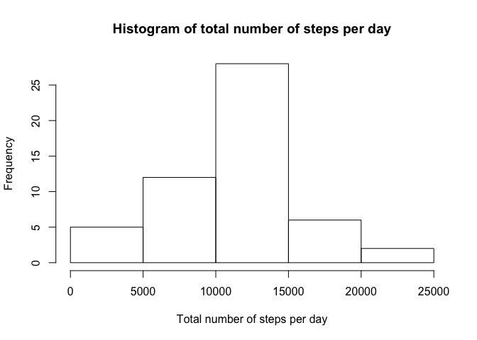
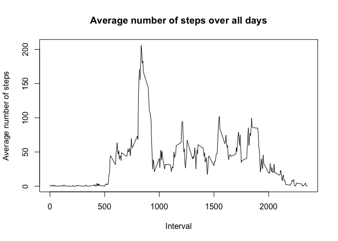
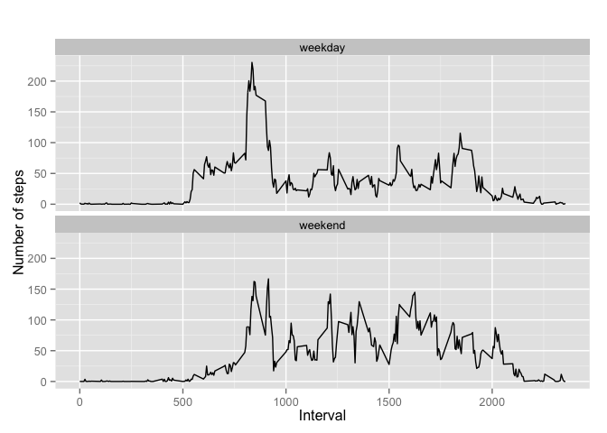

# Reproducible Research: Peer Assessment 1


## Loading and preprocessing the data
Show any code that is needed to

1. Load the data (i.e. `read.csv()`)

2. Process/transform the data (if necessary) into a format suitable for your analysis

```r
# load all packages used in this exploratory analysis
library(knitr)
library(dplyr)
library(ggplot2)
data_raw<-read.csv("/Users/anastasia/Documents/Coursera/Reproducible_Research/week2/activity.csv")
# remove NA in data
data <- data_raw[ with (data_raw, { !(is.na(steps)) } ), ]
# print out first 5 rows
head(data,5)
```

```
##     steps       date interval
## 289     0 2012-10-02        0
## 290     0 2012-10-02        5
## 291     0 2012-10-02       10
## 292     0 2012-10-02       15
## 293     0 2012-10-02       20
```


## What is mean total number of steps taken per day?
For this part of the assignment, you can ignore the missing values in
the dataset.

1. Make a histogram of the total number of steps taken each day

2. Calculate and report the **mean** and **median** total number of steps taken per day

```r
by_day <- group_by(data, date)
steps_by_day <- summarise(by_day, total = sum(steps))

hist(steps_by_day$total, main="Histogram of total number of steps per day", 
     xlab="Total number of steps per day")
```

 

```r
summary(steps_by_day)
```

```
##          date        total      
##  2012-10-02: 1   Min.   :   41  
##  2012-10-03: 1   1st Qu.: 8841  
##  2012-10-04: 1   Median :10765  
##  2012-10-05: 1   Mean   :10766  
##  2012-10-06: 1   3rd Qu.:13294  
##  2012-10-07: 1   Max.   :21194  
##  (Other)   :47
```

```r
# median = 10765
# mean = 10766
```

### What is the average daily activity pattern?

1. Make a time series plot (i.e. `type = "l"`) of the 5-minute interval (x-axis) and the average number of steps taken, averaged across all days (y-axis)

2. Which 5-minute interval, on average across all the days in the dataset, contains the maximum number of steps?

```r
# preprocessing data for plot
steps_by_interval <- aggregate(steps ~ interval, data, mean)

# create a time series plot 
plot(steps_by_interval$interval, steps_by_interval$steps, type='l', 
     main="Average number of steps over all days", xlab="Interval", 
     ylab="Average number of steps")
```

 

```r
# find row with max of steps
max_steps_row <- which.max(steps_by_interval$steps)

# find interval with this max
steps_by_interval[max_steps_row, ]
```

```
##     interval    steps
## 104      835 206.1698
```
### Imputing missing values

Note that there are a number of days/intervals where there are missing
values (coded as `NA`). The presence of missing days may introduce
bias into some calculations or summaries of the data.

1. Calculate and report the total number of missing values in the dataset (i.e. the total number of rows with `NA`s)

2. Devise a strategy for filling in all of the missing values in the dataset. The strategy does not need to be sophisticated. For example, you could use the mean/median for that day, or the mean for that 5-minute interval, etc.

3. Create a new dataset that is equal to the original dataset but with the missing data filled in.

4. Make a histogram of the total number of steps taken each day and Calculate and report the **mean** and **median** total number of steps taken per day. Do these values differ from the estimates from the first part of the assignment? What is the impact of imputing missing data on the estimates of the total daily number of steps?

```r
# find the total number of missing values
sum(is.na(data_raw))
```

```
## [1] 2304
```

```r
# replace all missing values by a mean for every 5-minute interval
data_imputed <- data_raw
for (i in 1:nrow(data_imputed)) {
  if (is.na(data_imputed$steps[i])) {
    interval_value <- data_imputed$interval[i]
    steps_value <- steps_by_interval[
      steps_by_interval$interval == interval_value,]
    data_imputed$steps[i] <- steps_value$steps
  }
}
# calculate  total number of steps taken each day
df_imputed_steps_by_day <- aggregate(steps ~ date, data_imputed, sum)

hist(df_imputed_steps_by_day$steps, main="Histogram of total number of steps per day (imputed)", 
     xlab="Total number of steps in a day")
```

 

```r
summary(steps_by_day)
```

```
##          date        total      
##  2012-10-02: 1   Min.   :   41  
##  2012-10-03: 1   1st Qu.: 8841  
##  2012-10-04: 1   Median :10765  
##  2012-10-05: 1   Mean   :10766  
##  2012-10-06: 1   3rd Qu.:13294  
##  2012-10-07: 1   Max.   :21194  
##  (Other)   :47
```

```r
summary(df_imputed_steps_by_day)
```

```
##          date        steps      
##  2012-10-01: 1   Min.   :   41  
##  2012-10-02: 1   1st Qu.: 9819  
##  2012-10-03: 1   Median :10766  
##  2012-10-04: 1   Mean   :10766  
##  2012-10-05: 1   3rd Qu.:12811  
##  2012-10-06: 1   Max.   :21194  
##  (Other)   :55
```

```r
# means are the same, medians are a little bit different
```

### Are there differences in activity patterns between weekdays and weekends?

For this part the `weekdays()` function may be of some help here. Use
the dataset with the filled-in missing values for this part.

1. Create a new factor variable in the dataset with two levels -- "weekday" and "weekend" indicating whether a given date is a weekday or weekend day.

1. Make a panel plot containing a time series plot (i.e. `type = "l"`) of the 5-minute interval (x-axis) and the average number of steps taken, averaged across all weekday days or weekend days (y-axis). The plot should look something like the following, which was created using **simulated data**:


```r
data_imputed['type_of_day'] <- weekdays(as.Date(data_imputed$date))
data_imputed$type_of_day[data_imputed$type_of_day  %in% c('Saturday','Sunday') ] <- "weekend"
data_imputed$type_of_day[data_imputed$type_of_day != "weekend"] <- "weekday"
# convert type_of_day from character to factor
data_imputed$type_of_day <- as.factor(data_imputed$type_of_day)

# calculate average steps by interval across all days
df_imputed_steps_by_interval <- aggregate(steps ~ interval + type_of_day, data_imputed, mean)

# creat a plot
qplot(interval, 
      steps, 
      data = df_imputed_steps_by_interval, 
      type = 'l', 
      geom=c("line"),
      xlab = "Interval", 
      ylab = "Number of steps", 
      main = "") +
  facet_wrap(~ type_of_day, ncol = 1)
```

 
